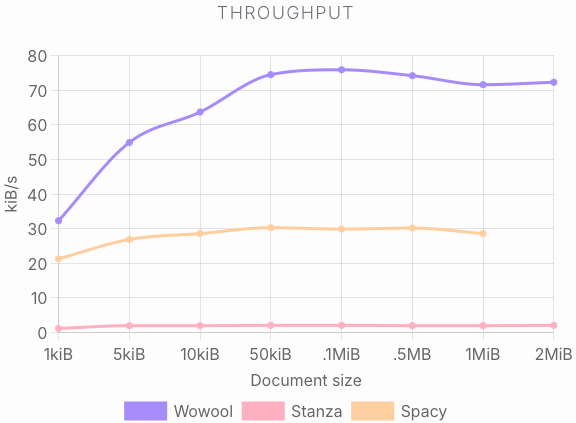
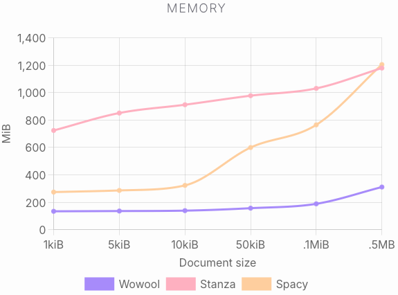

</img>

# NLP Compare

This tool allows you to compare different NLP engines with Wowool's NLP engine. Specifically, we compare Wowool vs Spacy, Stanza and Google.

## Features

| Feature             | Wowool | Spacy | Stanza | Google  | Notes                                                                                                                                  |
|---------------------|--------|-------|--------|---------|----------------------------------------------------------------------------------------------------------------------------------------|
| Anaphora            | Yes    | No    | Yes    | Poorly  | Most do not resolve pronouns like he, she. Only Google resolves some references like cities, or companies                              |
| Conjecture          | Yes    | No    | Yes    | No      | When mentioning something in context, Wowool will remember what it was later on                                                        |
| Custom extraction   | Yes    | No    | No     | No      | With the wowool language you can easily adapt the results to your business case                                                        |
| Compounds           | Yes    | No    | No     | No      | Wowool decompounds words for languages like swedish, german, dutch, danish and norwegian                                               |
| Aggregation         | Yes    | No    | No     | No      | Wowool aggregates attributes like positions, country, descriptions to Persons and Companies                                            |
| Instances           | Yes    | No    | No     | No      | Wowool keeps track of instances, collecting information such as *John Smith, John, He, J. Smith* as the same entity                    |
| Normalization       | Yes    | No    | Yes    | Yes     | In Wowool, *UK* is recognized as the same instance as *United Kingdom*                                                                 |
| Hyphenation         | Yes    | No    | Poorly | Poorly  | Spacy does not recognize split words, Google does not clean up, and gets it wrong with partial matches                                 |
| Augmented           | Yes    | No    | No     | Link    | Wowool can add external information to the entity that can be used (key people,headquarters,positions), Google only links to Wikipedia |
| Numbers             | Yes    | No    | No     | Yes     | Resolves written numbers like *five hundred billion dollars* -> 500000000700, *$2bn* -> 2000000000                                     |
| Resolving Dates     | Yes    | No    | No     | No      | Resolving to absolute dates. like: *two year ago* to the actual date starting from the initial publishing date                         | 
| Sentiment           | Yes    | Yes   | No     | Yes     | Wowool returns sentence-based sentiment analysis vs document based                                                                     |
| Attributes          | Yes    | No    | No     | No      | Annotations have attributes such as: gender, position, ...                                                                             |
| Ontologies          | places | No    | No     | No      | Things like UK, USA, Belgium, Europe, EU                                                                                               |
| Entity types        | +231   | 18    | 18     | 11      | The number of different types of entities                                                                                              |
| Sub Annotations     | Yes    | No    | No     | No      | Wowool supports subannotations like Triples that have Subject, Object, and Verb                                                        |
| Custom Domains      | Yes    | No    | No     | No      | Does not require training data, Wowool is a rule-based language                                                                        |
| Categorization      | Yes    | Yes   | No     | Yes     |                                                                                                                                        |
| Max Memory Fp (10k) | 54M    | 224M  | 816MB  | NA      | Using Scalene to run a 10k English file (note: could not run 100k as Stanza crashes)                                                   |

## Performance

### Recall, precision and F-score

| (%)       | Wowool | Spacy | Stanza | Google |
|-----------|--------|-------|--------|--------|
| Precision	| **93** | 79    | 84     |  85    |
| Recall	| **92** | 67    | 71     |  87    |
| F1 Score	| **93** | 73    | 77     |  86    |


### Throughput

| KiB  | Wowool | Spacy | Stanza | Wowool (kiB/s) | Spacy (kiB/s) | Stanza (kiB/s) |
|------|--------|-------|--------|----------------|---------------|----------------|
| 1    | 0.03   | 0.05  | 0.83   | 32.26          | 21.28         | 1.20           |
| 5    | 0.09   | 0.19  | 2.51   | 54.95          | 26.88         | 1.99           |
| 10   | 0.16   | 0.35  | 5.03   | 63.69          | 28.57         | 1.99           |
| 50   | 0.67   | 1.65  | 23.94  | 74.52          | 30.28         | 2.09           |
| 100  | 1.32   | 3.34  | 47.33  | 75.93          | 29.90         | 2.11           |
| 500  | 6.74   | 16.56 | 244.15 | 74.18          | 30.20         | 2.05           |
| 1000 | 13.97  | 34.95 | 479.12 | 71.58          | 28.62         | 2.09           |
| 2000 | 27.65  | CNR   | 973.86 | 72.33          | CNR           | 2.05           |

where `CNR` stands for 'could not run'.



### Memory



### Details

* [See memory.md](docs/memory.md)
* [See results.md](docs/results.md)

## Reproduction

To reproduce the results, you must install the different NLP engines.

### Wowool

* To test it yourself you will need to [acquire a license file](mailto:philippe@wowool.com).
* At this stage we only support Linux and macOS. On Windows you can use WLS
* These packages are currently hosted on a private repo so we will give you temporary access to it:

```
pip install wowool-sdk wowool-lxware-domain-english-entity wowool-community-license
```

### Spacy

```
pip install spacy
```

### Stanza

```
pip install stanza
```

### Google

To install Google NLP, you will need to setup the service yourself and add your key in the environment variable `GOOGLE_APPLICATION_CREDENTIALS` with the credential file.
