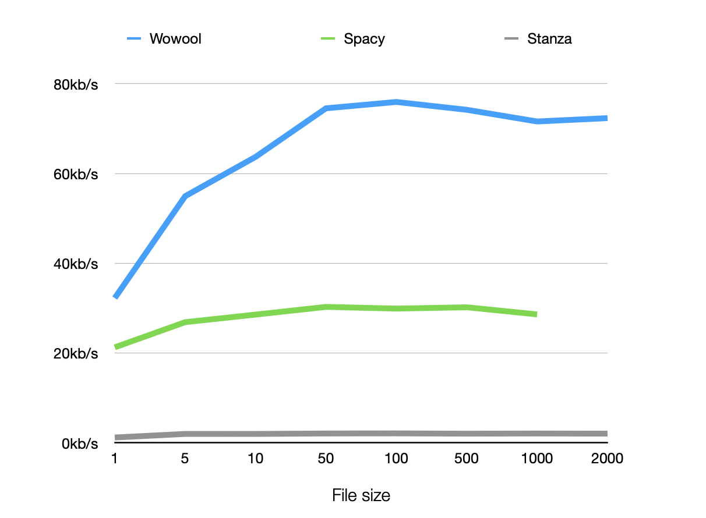
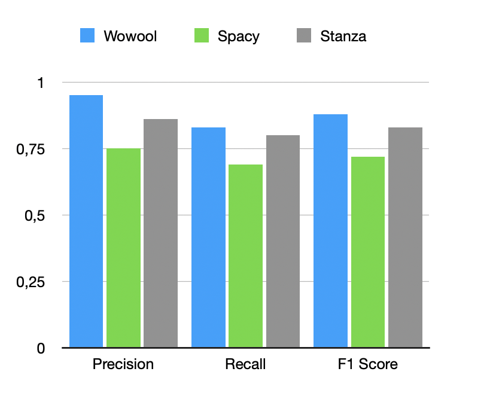

# NLP compare

This tool allows you to compare different nlp engines with the Wowool engine. In this readme we compare Wowool vs Spacy, Stanza and Google

## Features

We are going to compare several cases using Wowool, Spacy, Stanza and Google NLP.

| Feature           | Wowool  | Spacy    | Stanza   | Google   | Notes                                                                                                               |
|:------------------|:-------:|:--------:|:--------:|:--------:|---------------------------------------------------------------------------------------------------------------------|
| Anaphora          | Yes     | No       | Yes      | Poorly   | Most do not resolve pronouns like he, she. Only Google resolves some references like the city, or the company                             |
| Conjecture        | Yes     | No       | Yes      | No       | When mentioning something in context, Wowool will remember what it was later on                                     |
| Custom extraction | Yes     | No       | No       | No       | With the wowool language you can easily adapt the results to your business case                                |
| Compounds         | Yes     | No       | No       | No       | Wowool decompounds words for languages like swedish, german, dutch, danish and norwegian                                |
| Aggregation       | Yes     | No       | No       | No       | Wowool aggregates attributes like positions, country, descriptions to Persons and Companies                                                  |
| Instances         | Yes     | No       | No       | No       | Wowool keeps track of instances, collecting information such as *John Smith, John, He, J. Smith* as the same entity |
| Normalization     | Yes     | No       | Yes      | Yes      | In Wowool, *UK* is recognized as the same instance as *United Kingdom*                                              |
| Hyphenation       | Yes     | No       | Poorly   | Poorly   | Spacy does not recognize split words, Google does not clean up, and gets it wrong with partial matches              |
| Augmented         | Yes     | No       | No       | Link     | Wowool can add external information to the entity that can be used (key people,headquarters,positions), Google only links to Wikipedia |
| Numbers           | Yes     | No       | No       | Yes      | Resolves written numbers like *five hundred billion dollars* -> 500000000700, *$2bn* -> 2000000000                  |
| Resolving Dates   | Yes     | No       | No       | No       | Resolving to absolute dates. like: *two year ago* to the actual date starting from the initial publishing date      | 
| Sentiment         | Yes     | Yes      | No       | Yes      | Wowool returns sentence-based sentiment analysis vs document based                                                  |
| Attributes        | Yes     | No       | No       | No       | Annotations have attributes such as: gender, position, ...                                                          |
| Ontologies       | places  | No       | No       | No       | Things like UK, USA, Belgium, Europe, EU                                                                            |
| Entity types      | +231    | 18       | 18       | 11       | The number of different types of entities                                                                           |
| Sub Annotations   | Yes     | No       | No       | No       | Wowool supports subannotations like Triples that have Subject, Object, and Verb                                     |
| Custom Domains    | Yes     | No       | No       | No       | Does not require training data, Wowool is a rule-based language                                                     |
| Categorization    | Yes     | Yes      | No       | Yes      |    |
| Max Memory Fp (100k)  | 54M |  414M | 9000Mb | NA | using Scalene running a 10k english file |

## Timings

CNR = 'could not run'

| Kb    | Wowool | Spacy  | Stanza  | Wowool Kb/sec    | Spacy Kb/sec    | Stanza Kb/sec   |
|-------|--------|--------|---------|------------------|------------------|------------------|
| 1     | 0,031  | 0,047  | 0,835   | 32,258064516129  | 21,2765957446809 | 1,19760479041916 |
| 5     | 0,091  | 0,186  | 2,518   | 54,9450549450549 | 26,8817204301075 | 1,98570293884035 |
| 10    | 0,157  | 0,35   | 5,031   | 63,6942675159236 | 28,5714285714286 | 1,98767640628106 |
| 50    | 0,671  | 1,651  | 23,947  | 74,5156482861401 | 30,2846759539673 | 2,08794421013071 |
| 100   | 1,317  | 3,344  | 47,332  | 75,9301442672741 | 29,9043062200957 | 2,11273557001606 |
| 500   | 6,74   | 16,555 | 244,154 | 74,1839762611276 | 30,2023557837511 | 2,0478878085143  |
| 1000  | 13,97  | 34,946 | 479,118 | 71,5819613457409 | 28,6155783208379 | 2,08716850546212 |
| 2000  | 27,652 | CNR    | 973,859 | 72,3274989150875  | CNR             | 2,05368538977408 |

## Recall, precision and F-measure

Wowool

|           | Wowool   | Spacy   | Stanza   |
|-----------|:--------:|:-------:|:--------:|
| Precision	| **0,95** | 0,75    | 0,86     |
| Recall	| **0,83** | 0,69    | 0,80     |
| F1 Score	| **0,88** | 0,72    | 0,83     |

### Memory profiling:

[Link to memory.md](docs/memory.md)

## Detailed Results

[Link to results.md](docs/results.md)